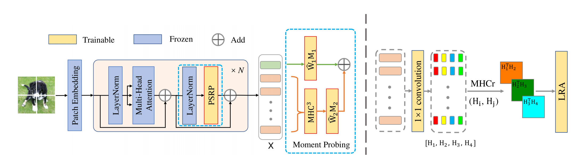

# MomentProbing_mindspore

This is an code implementation of ICCV2023 paper using mindspore( [Tuning Pre-trained Model via Moment Probing](https://ieeexplore.ieee.org/document/10377394) ), created by, Mingze Gao,Zhenyi Liu and Qilong Wang.


## Introduction
Recently, efficient fine-tuning of large-scale pre-trained models has attracted increasing research interests, where linear probing (LP) as a fundamental module is involved in exploiting the final representations for task-dependent classification. However, most of the existing methods focus on how to effectively introduce a few of learnable parameters, and little work pays attention to the commonly used LP module. In this paper, we propose a novel Moment Probing (MP) method to further explore the potential of LP. Distinguished from LP which builds a linear classification head based on the mean of final features (e.g., word tokens for ViT) or classification tokens, our MP performs a linear classifier on feature distribution, which provides the stronger representation ability by exploiting richer statistical information inherent in features. Specifically, we represent feature distribution by its characteristic function, which is efficiently approximated by using first- and second-order moments of features.


## Main Results on ImageNet with Pretrained Models


|Method          | Imagenet-1k | Cifar-100 | NABirds |CUB-200-2011| #Params.(M) (Imagenet-1k/other datasets )| Checkpoint                                                          |
| ------------------ | ----- | ------- | ----- | ----------------|--------------------|------------------------ |  
| LinearProbing  |  82.0 | 88.7 |   75.9  |    85.3|0.77/0.17           | |  
| Full-Finetune   |83.6 |   93.8| 85.7  |89.5|86.57/85.96 ||  
| MP++   | 84.0 |  94.0  |  85.9   |  89.3       |   4.10/1.64  |([Imagenet-1K ](https)  |  


## Usage
### Environments
●OS：18.04  
●CUDA：11.6  
●Toolkit：mindspore2.2  
●GPU:GTX 3090 

### Install

●First, Install the driver of NVIDIA  
●Then, Install the driver of CUDA  
●Last, Install cudnn  

create virtual enviroment mindspore
conda create -n mindspore python=3.7.5 -y
conda activate mindspore
CUDA 10.1 
```bash
conda install mindspore-gpu cudatoolkit=10.1 -c mindspore -c conda-forge
```
CUDA 11.1 
```bash
conda install mindspore-gpu cudatoolkit=11.1 -c mindspore -c conda-forge
```
validataion 
```bash
python -c "import mindspore;mindspore.run_check()"
```
### Data preparation


- FGVC & vtab-1k

You can follow [VPT](https://github.com/KMnP/vpt) to download them. 

Since the original [vtab dataset](https://github.com/google-research/task_adaptation/tree/master/task_adaptation/data) is processed with tensorflow scripts and the processing of some datasets is tricky, we also upload the extracted vtab-1k dataset in [onedrive](https://shanghaitecheducn-my.sharepoint.com/:f:/g/personal/liandz_shanghaitech_edu_cn/EnV6eYPVCPZKhbqi-WSJIO8BOcyQwDwRk6dAThqonQ1Ycw?e=J884Fp) for your convenience. You can download from here and then use them with our [vtab.py](https://github.com/dongzelian/SSF/blob/main/data/vtab.py) directly. (Note that the license is in [vtab dataset](https://github.com/google-research/task_adaptation/tree/master/task_adaptation/data)).


- CIFAR-100
```bash
wget https://www.cs.toronto.edu/~kriz/cifar-100-python.tar.gz
```
-ImageNet-1K
Download and extract ImageNet train and val images from http://image-net.org/. 
The directory structure is the standard layout for the torchvision [`datasets.ImageFolder`](https://pytorch.org/docs/stable/torchvision/datasets.html#imagefolder), 
and the training and validation data is expected to be in the `train/` folder and `val/` folder respectively:

```
/path/to/imagenet/
  train/
    class1/
      img1.jpeg
    class2/
      img2.jpeg
  val/
    class1/
      img3.jpeg
    class/2
      img4.jpeg
```
### Pretrained Checkpoint

### Evaluation

To evaluate a pre-trained model on ImageNet val with GPUs run:

```bash
python eval.py --device_target="GPU" --swin_config=$CONFIG_PATH --pretrained=$CHECKPOINT_PATH > eval.log 2>&1 &
```


### Training

#### Train with MomentProbing

You can run the `main.py` to train as follow:

```
mpirun --allow-run-as-root -n $2 \
    python train.py  --device_target="GPU" \
    --swin_config=$CONFIG_PATH \
    --pretrained=$CHECKPOINT_PATH \
    --seed=47 > log.txt 2>&1 &
```
For example:

```bash
mpirun --allow-run-as-root -n 8 \
    python train.py  --device_target="GPU" \
    --pretrained=$CHECKPOINT_PATH \
    --swin_config=src/configs/vit_patch16_imagenet2012_config.yml \
    --seed=47 > log.txt 2>&1 &

```

## Citation

```
@INPROCEEDINGS{10377394,
  author={Gao, Mingze and Wang, Qilong and Lin, Zhenyi and Zhu, Pengfei and Hu, Qinghua and Zhou, Jingbo},
  booktitle={2023 IEEE/CVF International Conference on Computer Vision (ICCV)}, 
  title={Tuning Pre-trained Model via Moment Probing}, 
  year={2023},
  pages={11769-11779},
  doi={10.1109/ICCV51070.2023.01084}}

```

# Acknowledgement
The work was sponsored by National Natural Science Foundation of China (Grant No.s 62276186, 61925602),  CAAI-Huawei MindSpore Open Fund under Grant CAAIXSJLJJ-2022-010 C, and Haihe Lab of ITAI (NO. 22HHXCJC00002). 
Our code are built following [ssf](https://github.com/securesocketfunneling/ssf), thanks for their excellent work. 
